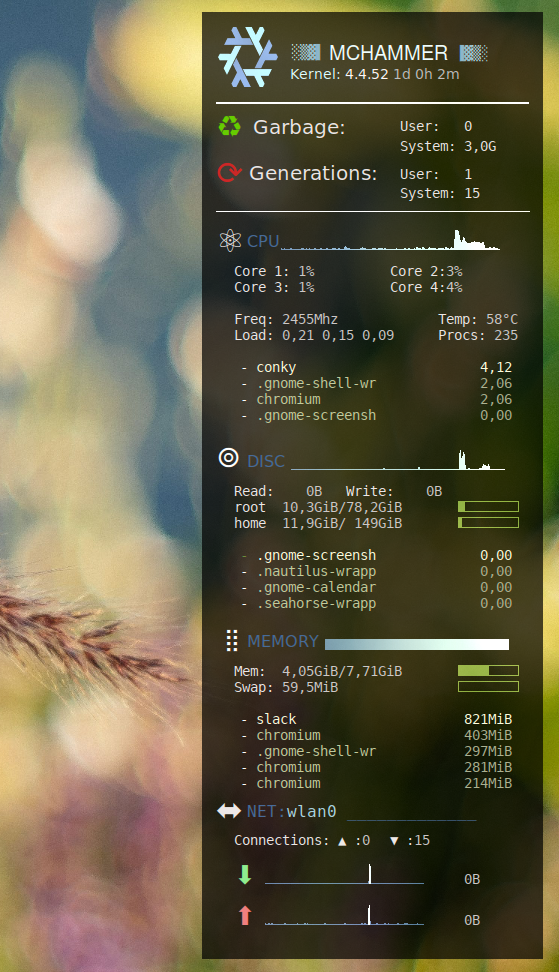

# Conky theme for Nixos
This a nix package of a a rework of my own conky theme adding some nixos specific features.

*Disclaimer* : The configuration it's buggy, it's messy and can cause 3º degree burns in your eyes so tweak at your own risk.

install: just (import /conkynixtheme.nix) in your environment.systemPackages and rebuild.
execute: conkynix

Interfaces: This theme recognice eth0, wlan0 and wlan1. if you want to rename it with nixos do something like this:
```
services.udev.extraRules = ''
    SUBSYSTEM=="net", ACTION=="add", ATTR{address}=="a4:34:d9:d9:67:82", NAME="wlan0"
      '';
```
Pics or didn't happend:


Have fun!
